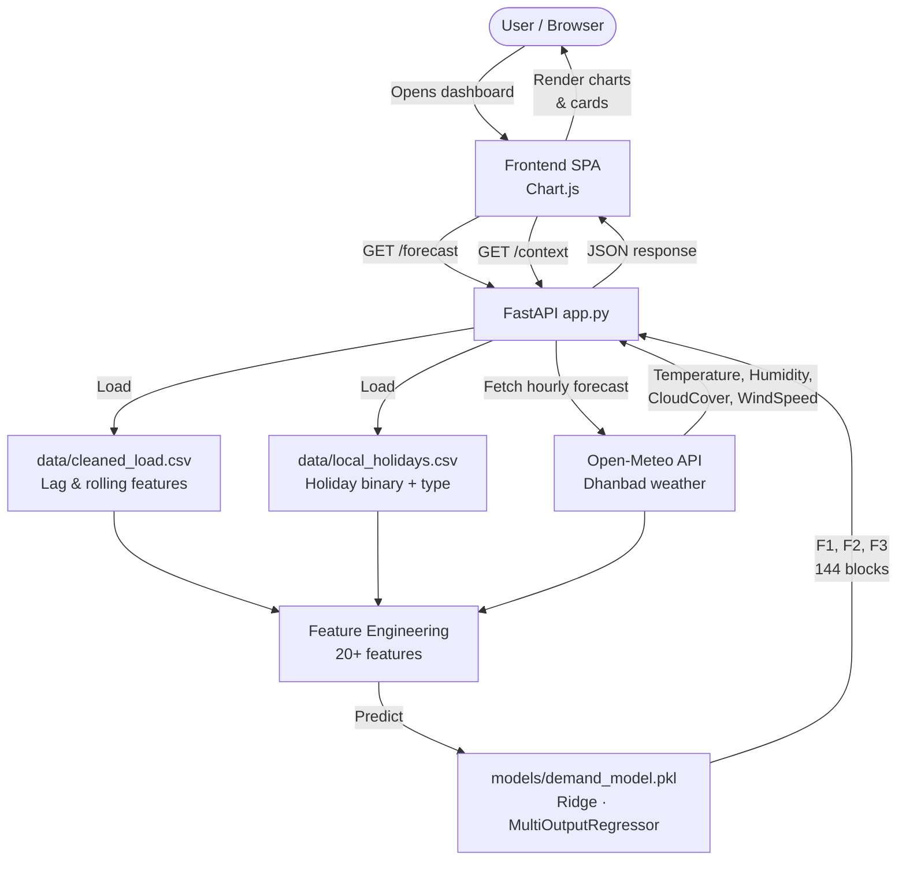

# ⚡ Intelligent Power Demand Forecasting

A full-stack, containerized prototype for predicting electricity demand at **10-minute intervals** (144 blocks/day) for **Apex Power & Utilities (APU)** in **Dhanbad, Jharkhand**, India. Built as part of the Exascale Deeptech & AI Pvt. Ltd. hiring process.

---

## 📋 Table of Contents

- [Overview](#overview)
- [Features](#features)
- [Project Structure](#project-structure)
- [Architecture & Design](#architecture--design)
- [Technology Stack](#technology-stack)
- [Data Pipeline](#data-pipeline)
- [Model Details](#model-details)
- [API Endpoints](#api-endpoints)
- [Setup & Installation](#setup--installation)
- [Usage Guide](#usage-guide)
- [Evaluation Criteria Coverage](#evaluation-criteria-coverage)
- [Future Improvements](#future-improvements)

---

## 📖 Overview

This prototype enables APU to:

- **Predict electricity demand** for three 132KV feeders (F1, F2, F3) every 10 minutes
- **Integrate real-time weather data** (Temperature, Humidity, Cloud Cover, Wind Speed) from the Open-Meteo API
- **Account for local holidays** specific to Dhanbad/Jharkhand (Chhath Puja, Sarhul, Karma Puja, etc.)
- **Visualize forecasts** with interactive charts and downloadable CSV reports
- **Deploy consistently** using Docker containerization

---

## ✨ Features

### 🔹 Core Forecasting

- **Multi-output prediction** — Simultaneously forecasts F1, F2, and F3 feeder loads
- **10-minute granularity** — 144 prediction blocks per 24-hour window
- **Real-time weather integration** — Fetches live weather forecast from Open-Meteo API
- **Local holiday awareness** — 20+ Dhanbad-specific holidays (festive, national, industrial, local)
- **Lag & rolling features** — 1-day lag, 7-day lag, 24-hour rolling mean

### 🔹 Data Cleaning & EDA

- **Missing timestamp handling** — Reindexed to complete 10-minute frequency
- **Outlier treatment** — IQR-based clipping on all power and weather columns
- **Imputation** — Time-based linear interpolation for power, forward-fill for weather
- **Thorough EDA** — Statistical summaries, boxplots, correlation heatmaps, time-series plots

### 🔹 API & Backend

- **`/forecast` endpoint** — Returns 24-hour demand predictions (144 blocks)
- **`/context` endpoint** — Returns weather data + holiday markers for frontend annotations
- **FastAPI** with auto-generated OpenAPI documentation at `/docs`

### 🔹 Frontend Dashboard

- **Interactive line chart** with "Now" marker and holiday annotations
- **Pie chart** showing feeder-wise distribution (Full Day or Single Hour)
- **View toggle** — Full Day (144 blocks) or Single Hour (6 blocks)
- **Scrollable forecast table** with downloadable CSV export
- **Weather sparklines** — 24-hour trend charts for Temperature, Humidity, Cloud Cover, Wind Speed
- **Current weather card** with real-time metrics
- **Hourly weather strip** (Google-style) starting from current hour with "Tomorrow" badges
- **Holiday table** with date, name, type, and forecast window range
- **Tabbed navigation** — Forecast tab + Weather & Holidays tab
- **Animations** — Fade-in, hover lift effects, emoji-enhanced cards

---

## 📁 Project Structure

```
Assignment-1/
│
├── app.py                  # FastAPI application — /forecast and /context endpoints
├── dockerfile              # Docker build instructions
├── requirements.txt        # Python dependencies
├── package.json            # Node metadata (for frontend tooling)
├── package-lock.json
├── .gitignore
├── .hintrc
│
├── Notebook.ipynb          # ← EDA, data cleaning, feature engineering & model training
│                           #   (Start here to understand the full data science workflow)
│
├── data/
│   ├── Utility_consumption.csv   # Raw input — timestamped load data for F1, F2, F3 + weather
│   ├── cleaned_load.csv          # ← Cleaned dataset output after all preprocessing steps
│   │                             #   (reindexed, outliers clipped, interpolated — ready for modelling)
│   └── local_holidays.csv        # Self-compiled Dhanbad-specific holiday list (20+ entries)
│
├── models/
│   ├── demand_model.pkl    # Trained MultiOutputRegressor + Ridge pipeline (serialized)
│   └── feature_names.pkl   # Feature column names used during training (for inference alignment)
│
└── frontend/
    └── ...                 # HTML/CSS/JS — Chart.js dashboard served as static files
```

> **Where to start:**
> - **Data science workflow** → open `Notebook.ipynb` at the project root
> - **Cleaned data** → `data/cleaned_load.csv` (output of the preprocessing pipeline in the notebook)
> - **Trained model** → `models/demand_model.pkl`
> - **API server** → `app.py`

---

## 🏗 Architecture & Design

### High-Level Architecture

```
┌─────────────────────────────────────────────────────────────────┐
│                  Docker Container (port :8000)                  │
│                                                                 │
│  ┌──────────────┐  HTTP/REST  ┌──────────────────────────────┐  │
│  │ Frontend SPA │ ◄─────────► │      FastAPI Backend         │  │
│  │              │             │         (app.py)             │  │
│  │ Line chart   │             │                              │  │
│  │ Pie chart    │             │  ┌──────────────────────┐    │  │
│  │ Sparklines   │             │  │  /forecast           │    │  │
│  │ Hourly strip │             │  │  144 blocks          │    │  │
│  │ Holiday table│             │  │  F1, F2, F3          │    │  │
│  │ CSV export   │             │  ├──────────────────────┤    │  │
│  │              │             │  │  /context            │    │  │
│  │ Chart.js +   │             │  │  Weather + holidays  │    │  │
│  │ Annotation   │             │  └──────────────────────┘    │  │
│  └──────────────┘             │                              │  │
│                               │  Feature Engineering         │  │
│                               │  ┌──────────────────────┐    │  │
│                               │  │  demand_model.pkl    │    │  │
│                               │  │  feature_names.pkl   │    │  │
│                               │  │  Ridge · R² ≈ 0.90   │    │  │
│                               │  └──────────────────────┘    │  │
│                               │                              │  │
│                               │  ┌──────────────────────┐    │  │
│                               │  │  data/               │    │  │
│                               │  │  cleaned_load.csv    │    │  │
│                               │  │  local_holidays.csv  │    │  │
│                               │  └──────────────────────┘    │  │
│                               └──────────────┬───────────────┘  │
└──────────────────────────────────────────────│──────────────────┘
                                               │ HTTP (live fetch)
                                               ▼
                                  ┌────────────────────────┐
                                  │   Open-Meteo API       │
                                  │   Dhanbad weather      │
                                  │   lat=23.79, lon=86.43 │
                                  └────────────────────────┘
```

### Data Flow



### Design Decisions

| Decision | Rationale |
|----------|-----------|
| **MultiOutputRegressor + Ridge** | Best R² (~0.9) after comparing Ridge, Lasso, RandomForest; L2 regularization handled feature interactions well |
| **10-minute resampling** | Open-Meteo provides hourly data; forward-fill to 10-min is acceptable for weather (slow-changing) |
| **IQR outlier clipping** | Robust to skewed distributions, preserves data volume |
| **Time-based interpolation** | Respects temporal structure better than mean/median imputation |
| **FastAPI** | Async support, auto-generated Swagger docs, easy static file serving |
| **Chart.js + Annotation Plugin** | Lightweight interactive charts with built-in holiday band support |
| **Docker** | Ensures a consistent environment across evaluator machines |
| **Local holidays CSV** | Self-sourced for Dhanbad-specific festivals (Chhath, Sarhul, Karma) not in generic national calendars |

---

## 🛠 Technology Stack

| Layer | Technology | Version |
|-------|------------|---------|
| **Backend** | FastAPI | Latest |
| **ML Library** | scikit-learn | Latest |
| **Data Processing** | pandas, numpy | Latest |
| **Weather API** | Open-Meteo | Free (no key required) |
| **Frontend** | HTML5 + CSS3 + JavaScript | — |
| **Charts** | Chart.js + chartjs-plugin-annotation | 4.x |
| **Containerization** | Docker | Latest |
| **Language** | Python | 3.10 |

---

## 📊 Data Pipeline

> The full pipeline is documented and executed in **`Notebook.ipynb`** at the project root.

### 1. Raw Data Ingestion

| File | Description |
|------|-------------|
| `data/Utility_consumption.csv` | Timestamped load data for 3 feeders + raw weather columns |
| `data/local_holidays.csv` | Self-compiled Dhanbad holiday list (20+ entries) |

### 2. Data Cleaning → `data/cleaned_load.csv`

The cleaned output is saved as `data/cleaned_load.csv` and is used directly by `app.py` at inference time.

| Step | Method | Justification |
|------|--------|---------------|
| Missing timestamps | Reindex to full 10-min range | Ensures a continuous time series for lag features |
| Outliers | IQR clipping (factor = 1.5) | Robust to skewed distributions, preserves data volume |
| Power imputation | Time-based linear interpolation | Preserves diurnal demand patterns |
| Weather imputation | Forward-fill then back-fill | Weather changes slowly; ffill is sufficient |

### 3. Feature Engineering

| Category | Features |
|----------|----------|
| **Time** | `hour`, `minute`, `dayofweek`, `month` |
| **Holiday** | `is_holiday` (binary), `holiday_type` (national / festive / industrial / local) |
| **Weather** | `Temperature`, `Humidity`, `CloudCover`, `WindSpeed` |
| **Lag** | `F1_lag1d`, `F1_lag7d` (and equivalent for F2, F3) |
| **Rolling** | `F1_rolling24h` (and equivalent for F2, F3) |

### 4. Model Training

| Parameter | Value |
|-----------|-------|
| Train/test split | Chronological 80/20 (no shuffle) |
| Models compared | Ridge (L2), Lasso (L1), RandomForest |
| Best model | Ridge with StandardScaler pipeline |
| Output | Multi-output prediction for F1, F2, F3 simultaneously |

---

## 🤖 Model Details

| Parameter | Value |
|-----------|-------|
| **Algorithm** | Ridge Regression (L2 Regularization) |
| **Alpha** | 0.1 |
| **Preprocessing** | StandardScaler |
| **Wrapper** | MultiOutputRegressor |
| **R² Score** | ~0.8966 |
| **Features** | 20+ engineered features |
| **Targets** | F1, F2, F3 (3 feeders simultaneously) |
| **Artifacts** | `models/demand_model.pkl`, `models/feature_names.pkl` |

---

## 🔗 API Endpoints

### Forecast

| Method | Endpoint | Description |
|--------|----------|-------------|
| `GET` | `/forecast` | Returns 24-hour load prediction (144 blocks, 10-min intervals) for F1, F2, F3 |

**Response format:**

```json
{
  "timestamps": ["2026-06-20 14:20", "2026-06-20 14:30", "..."],
  "F1": [28332.15, 27791.39, "..."],
  "F2": [18386.63, 17934.35, "..."],
  "F3": [19032.29, 18639.04, "..."]
}
```

### Context (Weather & Holidays)

| Method | Endpoint | Description |
|--------|----------|-------------|
| `GET` | `/context` | Returns weather data + holiday markers for the same 144-block window |

**Response format:**

```json
{
  "timestamps": ["2026-06-20 14:20", "..."],
  "Temperature": [32.5, 32.3, "..."],
  "Humidity": [65, 66, "..."],
  "CloudCover": [45, 42, "..."],
  "WindSpeed": [5.2, 5.1, "..."],
  "Holidays": [{"name": null}, {"name": "Chhath Puja"}, "..."]
}
```

### System

| Method | Endpoint | Description |
|--------|----------|-------------|
| `GET` | `/docs` | Auto-generated Swagger UI |

---

## 🚀 Setup & Installation

### Prerequisites

- [Docker](https://www.docker.com/get-started/) installed on your system
- [Git](https://git-scm.com/) for cloning the repository

### Quick Start

```bash
# 1. Clone the repository
git clone <your-repo-url>
cd Assignment-1

# 2. Build the Docker image
docker build -t demand-forecast .

# 3. Run the container
docker run -p 8000:8000 demand-forecast

# 4. Access the application
#    Frontend Dashboard:   http://localhost:8000
#    API Documentation:    http://localhost:8000/docs
```

### Running in the Background

```bash
docker run -d -p 8000:8000 --name demand-forecast demand-forecast
```

### Stopping the Container

```bash
docker stop demand-forecast
docker rm demand-forecast
```

### Clean Rebuild

```bash
docker stop demand-forecast
docker rm demand-forecast
docker build -t demand-forecast .
docker run -p 8000:8000 demand-forecast
```

### Local Development (without Docker)

```bash
pip install -r requirements.txt
uvicorn app:app --host 0.0.0.0 --port 8000 --reload
```

---

## 📖 Usage Guide

### 1. Forecast Tab

- **Line chart** — View F1, F2, F3, and Total demand across 144 blocks with a red "Now" marker
- **Pie chart** — Toggle to see feeder-wise load distribution (Full Day or Single Hour)
- **View selector** — Switch between "Full Day" (144 blocks) or "Single Hour" (6 blocks)
- **Hour selector** — When "Single Hour" is chosen, pick any hour 0–23
- **Download CSV** — Export the full forecast as `forecast.csv` (timestamp + F1 / F2 / F3 / Total)

### 2. Weather & Holidays Tab

- **Weather sparklines** — 24-hour trend charts for Temperature, Humidity, Cloud Cover, Wind Speed
- **Current weather card** — Shows current temperature with humidity, cloud cover, and wind details
- **Hourly strip** — Google-style scrollable hourly forecast from current hour; cards after midnight carry a "Tomorrow" badge
- **Holiday table** — Lists upcoming holidays within the forecast window with date, name, type, and forecast window range

### 3. Holiday Annotations

- On the line chart (Full Day view), local holidays appear as semi-transparent red bands
- Chhath Puja, Diwali, Holi, Sarhul, and Karma Puja are automatically flagged

---

## ✅ Evaluation Criteria Coverage

| Criterion | Points | Implementation |
|-----------|--------|----------------|
| EDA & Visualization | 15 | Statistical summaries, boxplots, correlation heatmap, time-series plots in `Notebook.ipynb` |
| Data Cleaning | 10 | Missing timestamp reindexing, IQR outlier clipping, time-based interpolation — all documented in `Notebook.ipynb`; output saved to `data/cleaned_load.csv` |
| Weather Data Sourcing | 10 | Real-time Open-Meteo API integration for Dhanbad (Temperature, Humidity, Cloud Cover, Wind Speed) |
| Local Holidays | 10 | Self-sourced 20+ Dhanbad-specific holidays in `data/local_holidays.csv` (Chhath Puja, Sarhul, Karma Puja, mining holidays, etc.) |
| Feature Engineering | 10 | Time features, lag features (1d, 7d), rolling mean (24h), holiday binary + categorical, weather features |
| Model Justification | 15 | Compared Ridge, Lasso, RandomForest in `Notebook.ipynb`; selected Ridge based on R² and MAPE |
| Model Implementation | 10 | MultiOutputRegressor + Ridge + StandardScaler pipeline; saved as `models/demand_model.pkl` with `models/feature_names.pkl` |
| Forecast API | 5 | `GET /forecast` returns 144-block prediction for F1, F2, F3 |
| Context API | 5 | `GET /context` returns weather + holiday data for frontend visualization |
| Frontend Charts | 10 | Interactive line chart with "Now" marker, pie chart, toggle views, holiday annotations |
| Weather / Holiday UI | — | Weather sparklines, current weather card, hourly strip, holiday table with window range |
| Docker | 10 | Single `dockerfile`, documented build/run commands above |
| README | — | This document |