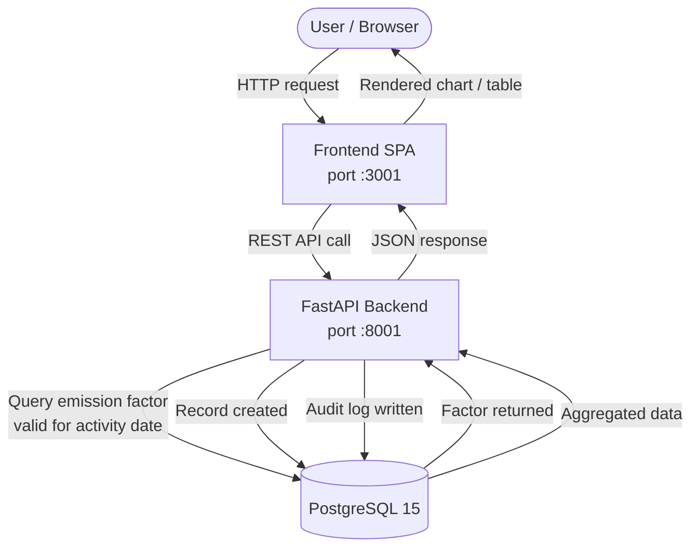

# 🌍 GHG Emissions Reporting Platform

A full-stack, containerized platform for tracking, calculating, and visualizing Greenhouse Gas (GHG) emissions based on the internationally recognized **GHG Protocol**.

---

## 📋 Table of Contents

- [Overview](#overview)
- [Features](#features)
- [Architecture & Design](#architecture--design)
- [Technology Stack](#technology-stack)
- [Database Schema](#database-schema)
- [API Endpoints](#api-endpoints)
- [Setup & Installation](#setup--installation)
- [Usage Guide](#usage-guide)
- [Evaluation Criteria Coverage](#evaluation-criteria-coverage)
- [Future Improvements](#future-improvements)

---

## 📖 Overview

This platform enables organizations to:

- Track **Scope 1, 2, and 3** emissions
- Calculate emissions using **historically accurate** emission factors
- Analyze **emission intensity** per unit of production
- Identify **emission hotspots** by source
- Compare **Year-over-Year** emissions
- Maintain a **complete audit trail** of all manual overrides
- Export data via **CSV** with filters

---

## ✨ Features

### 🔹 Core Functionality

- **Emission Calculation Engine** — Activity Data × Emission Factor = GHG Emissions (kgCO₂e)
- **Scope 1, 2, and 3** support across all process areas
- **Versioned Emission Factors** with `valid_from` / `valid_to` date ranges
- **Manual Override** with a complete, timestamped audit trail
- **User Roles & Permissions** — CEO, VP, Manager, Supervisor, Employee

### 🔹 Analytics & Reporting

- **Year-over-Year (YoY) Comparison** with year selector (2023, 2024)
- **Emission Intensity API** with dynamic metric selection
- **Emission Hotspots** breakdown by source (Scope 1, 2, 3)
- **Quarterly Emission Trend** with year selector
- **KPI Dashboard** with real-time metrics

### 🔹 Data Management

- **Business Metrics** submission (production, employees, revenue, etc.)
- **Filtered Records** by scope and material
- **CSV Export** with query filters
- **Audit Log** for every CREATE and OVERRIDE action

### 🔹 User Experience

- **Single-page application** with tabbed navigation
- **Responsive design** (mobile-friendly)
- **Real-time calculation** feedback
- **Interactive charts** powered by Chart.js

---

## 🏗 Architecture & Design

### High-Level Architecture

```
┌──────────────────────────────────────────────────────────────┐
│                   Docker Compose Network                     │
│                                                              │
│  ┌──────────────┐   HTTP/REST   ┌──────────────────────────┐ │
│  │   Frontend   │ ◄──────────► │    FastAPI Backend       │ │
│  │    (SPA)     │               │                          │ │
│  │              │               │  ┌────────────────────┐  │ │
│  │ HTML/CSS/JS  │               │  │   Emissions API    │  │ │
│  │  Chart.js    │               │  │ CRUD, export,      │  │ │
│  │              │               │  │ override           │  │ │
│  │  port :3001  │               │  ├────────────────────┤  │ │
│  └──────────────┘               │  │   Analytics API    │  │ │
│                                 │  │ YoY, intensity,    │  │ │
│                                 │  │ hotspots           │  │ │
│                                 │  ├────────────────────┤  │ │
│                                 │  │   Metrics API      │  │ │
│                                 │  │ Business data      │  │ │
│                                 │  └────────────────────┘  │ │
│                                 │                          │ │
│                                 │  SQLAlchemy ORM          │ │
│                                 │  port :8001              │ │
│                                 └────────────┬─────────────┘ │
│                                              │ ORM / SQL      │
│                                    ┌─────────▼─────────────┐ │
│                                    │    PostgreSQL 15       │ │
│                                    │                        │ │
│                                    │  emission_factors      │ │
│                                    │  emission_records      │ │
│                                    │  audit_logs            │ │
│                                    │  business_metrics      │ │
│                                    │                        │ │
│                                    │  Versioned factors     │ │
│                                    │  Audit trail           │ │
│                                    │  ACID compliant        │ │
│                                    └───────────────────────┘ │
└──────────────────────────────────────────────────────────────┘
```

### Data Flow



### Design Decisions

| Decision | Rationale |
|----------|-----------|
| **FastAPI** | Async, auto-generated OpenAPI docs (`/docs`), fast development cycle |
| **PostgreSQL** | Robust, supports versioning with date ranges, JSON fields, ACID compliance |
| **SQLAlchemy** | ORM for database abstraction; clean model definitions and migrations |
| **Chart.js** | Lightweight interactive charts without heavy frontend dependencies |
| **Docker Compose** | Consistent, reproducible deployment across environments |
| **SPA Architecture** | Single HTML file with dynamic tab-based content loading |

---

## 💾 Database Schema

### Table: `emission_factors`

| Column | Type | Description |
|--------|------|-------------|
| `id` | UUID (PK) | Unique identifier for each factor |
| `scope` | INTEGER | 1, 2, or 3 |
| `section` | VARCHAR | Process/Section (e.g., Pellet Plant) |
| `material` | VARCHAR | Material or energy type |
| `unit` | VARCHAR | Unit of measurement |
| `factor_value` | FLOAT | Emission factor value |
| `source` | VARCHAR | Data source (e.g., IPCC 2006) |
| `valid_from` | DATE | Start of validity period |
| `valid_to` | DATE | End of validity period |
| `is_excel_data` | BOOLEAN | True if loaded from Excel |

### Table: `emission_records`

| Column | Type | Description |
|--------|------|-------------|
| `id` | INTEGER (PK) | Auto-incrementing ID |
| `scope` | INTEGER | 1, 2, or 3 |
| `activity_date` | DATE | When the activity occurred |
| `material` | VARCHAR | Material/energy type |
| `quantity` | FLOAT | Activity quantity |
| `unit` | VARCHAR | Unit of measurement |
| `factor_id` | UUID (FK) | Reference to `emission_factors` |
| `calculated_emission` | FLOAT | Quantity × Factor |
| `is_override` | BOOLEAN | True if manually overridden |
| `override_reason` | TEXT | Reason for override |
| `created_by` | VARCHAR | User who created the record |
| `user_position` | VARCHAR | User's position (CEO, VP, etc.) |
| `is_excel_data` | BOOLEAN | True if loaded from Excel |

### Table: `audit_logs`

| Column | Type | Description |
|--------|------|-------------|
| `id` | INTEGER (PK) | Auto-incrementing ID |
| `record_id` | INTEGER | Reference to `emission_records` |
| `action` | VARCHAR | `CREATE`, `UPDATE`, or `OVERRIDE` |
| `old_value` | JSON | Previous values before change |
| `new_value` | JSON | New values after change |
| `changed_by` | VARCHAR | User who made the change |
| `changed_at` | TIMESTAMP | When the change occurred |

### Table: `business_metrics`

| Column | Type | Description |
|--------|------|-------------|
| `id` | INTEGER (PK) | Auto-incrementing ID |
| `metric_date` | DATE | Date of the metric |
| `metric_name` | VARCHAR | Name (e.g., Steel Production) |
| `value` | FLOAT | Metric value |
| `unit` | VARCHAR | Unit (tonnes, count, INR) |

---

## 🛠 Technology Stack

| Layer | Technology | Version |
|-------|------------|---------|
| **Backend** | FastAPI | 0.104.1 |
| **ORM** | SQLAlchemy | 2.0.23 |
| **Database** | PostgreSQL | 15 |
| **Frontend** | HTML5 + CSS3 + JavaScript | — |
| **Charts** | Chart.js | 4.4.0 |
| **Containerization** | Docker & Docker Compose | — |
| **Language** | Python | 3.10 |

---

## 🔗 API Endpoints

### Emissions

| Method | Endpoint | Description |
|--------|----------|-------------|
| `GET` | `/api/emissions` | Get all emission records (filter by scope/material) |
| `POST` | `/api/emissions` | Create a new emission record |
| `GET` | `/api/emissions/{record_id}` | Get record details with factor info |
| `PUT` | `/api/emissions/{record_id}/override` | Override a record (with audit trail) |
| `GET` | `/api/emissions/export/csv` | Export filtered records as CSV |

### Analytics

| Method | Endpoint | Description |
|--------|----------|-------------|
| `GET` | `/api/analytics/yoy` | Year-over-Year emissions by scope |
| `GET` | `/api/analytics/intensity` | Emission intensity for a period |
| `GET` | `/api/analytics/hotspots` | Emission breakdown by source |
| `GET` | `/api/analytics/quarterly-trend` | Quarterly emission trend |

### Metrics

| Method | Endpoint | Description |
|--------|----------|-------------|
| `GET` | `/api/metrics` | Get all business metrics |
| `POST` | `/api/metrics` | Create a business metric |
| `GET` | `/api/metrics/names` | Get unique metric names with units |

### System

| Method | Endpoint | Description |
|--------|----------|-------------|
| `GET` | `/health` | Health check |
| `GET` | `/docs` | Auto-generated Swagger UI |

---

## 🚀 Setup & Installation

### Prerequisites

- [Docker](https://www.docker.com/get-started/) installed on your system
- [Git](https://git-scm.com/) for cloning the repository

### Quick Start

```bash
# 1. Clone the repository
git clone <your-repo-url>
cd Assignment-2

# 2. Build and run the application
docker-compose up --build

# 3. Access the application
#    Frontend:         http://localhost:3001
#    Backend API:      http://localhost:8001
#    API Docs (Swagger): http://localhost:8001/docs
```

### Running in the Background

```bash
docker-compose up -d
```

### Stopping the Application

```bash
docker-compose down
```

### Clean Rebuild (Resets the Database)

```bash
docker-compose down -v
docker-compose up --build
```

---

## 📖 Usage Guide

### 1. Dashboard

- **KPI cards** — total emissions, scope breakdowns, emission intensity
- **YoY chart** — compare emissions across years (use year selector)
- **Hotspot charts** — identify top emission sources for Scope 1, 2, 3
- **Quarterly trend** — track emissions over time (with year selector)

### 2. Enter Data

1. Select Scope (1, 2, or 3)
2. Enter Material/Energy Type
3. Enter Quantity and Activity Date
4. Provide User ID and Position
5. Click **Calculate & Save**

### 3. Business Metrics

- Submit production data (Steel Production, Employees, Revenue, etc.)
- Metrics feed into Emission Intensity calculations
- Dynamic dropdowns update automatically

### 4. Intensity Analysis

1. Select Metric (Steel Production, Employees, etc.)
2. Select Period (Q1–Q4 or Full Year)
3. View intensity calculation with full breakdown

### 5. Source Details

1. Select Scope and Source (Material/Energy Type)
2. View all records for that source with total emissions

### 6. All Records

- Filter by Scope and Material
- View record details with factor UUID
- Override records (subject to position-based permissions)

### 7. Audit Log

- Track all manual overrides with timestamps
- See who changed what, when, and why

### Override Permissions

| Position | Permission |
|----------|-----------|
| CEO | Can override any record |
| VP | Can override any record except a CEO's |
| Manager | Can override records from positions below |
| Supervisor | Can override Employee records |
| Employee | Can only override their own records |

---

## 📊 Evaluation Criteria Coverage

| Criterion | Implementation |
|-----------|----------------|
| Architecture diagram | ✅ ASCII diagram + Mermaid data flow above |
| Technology stack | ✅ FastAPI + PostgreSQL + Docker |
| Versioned factors | ✅ `valid_from` / `valid_to` in `emission_factors` |
| Business metrics | ✅ `business_metrics` table |
| YoY API | ✅ `/api/analytics/yoy` with year selector |
| Intensity API | ✅ `/api/analytics/intensity` with metric/period |
| Hotspot API | ✅ `/api/analytics/hotspots` (Scope 1, 2, 3) |
| Historical accuracy | ✅ Factors selected by `activity_date` |
| Scope 1 & 2 CRUD | ✅ `POST /api/emissions` |
| Manual override | ✅ `PUT /api/emissions/{id}/override` with audit |
| Audit trail | ✅ `audit_logs` table |
| Data entry form | ✅ Scope 1, 2, 3 + Business Metrics tabs |
| YoY chart | ✅ Stacked bar chart (Chart.js) |
| Hotspot chart | ✅ Donut chart per scope |
| KPI card | ✅ Emission Intensity card |
| Trend chart | ✅ Quarterly trend line chart |
| Docker | ✅ `docker-compose.yml` |
| README | ✅ This document |